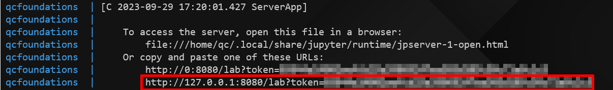

# Quantum Computing Foundations Examples

*Andy Dolan | Senior Security Engineer | CableLabs*

This repository provides code examples that illustrate basic operations with
IBM's [Qiskit][qiskit] for creating applications to be run on quantum computers.
The Qiskit library is Python-based, and the examples are run locally via
Qiskit's simulators. These examples were referenced in the member/vendor webinar
produced by CableLabs on quantum computing foundations in September of 2023.

The examples are contained in the following notebooks:

* **`Basics.ipynb`**: Simple invocations of Qiskit API calls to establish and
  manipulate Qubit states.
* **`Quantum Gates.ipynb`**: Manual computations of a quantum circuit using the
  matrix representations of the gates that make it up.
* **`Applications.ipynb`**: A high-level review of the Deutsch and Deutsch-Jozsa
  algorithms, with implementations of the circuits and examples in Qiskit.

## Getting Started

### Run with Docker Compose

A Docker image of the notebooks and the dependencies needed to run them is
provided for a convenient way to jump right into the code. The simplest way to
do so is to use `docker compose` to instantiate a notebook server with the
proper port exposed.

To run the example, simply use `docker compose up` in this directory. Once the
container has been created, click the link in the log output to navigate to the
instance of Jupyter lab. The image below shows an example of the link to
navigate to:



Your browser should navigate to the Jupyter Lab interface, from which you will
be able to open any of the example notebooks and execute their content.

To stop running the example notebook server, simply perform a `ctrl-c` in the
terminal running `docker compose`. The `docker-compose.yml` configuration
defines volumes that will persist any changes made to the notebooks (or
additional notebooks you may want to create). The easiest way to perform a full
reset of the example is to perform the following in this directory:

```sh
docker compose down -v
docker compose up
```

The container image is pulled from the CableLabs [Artifactory
instance][cl-artifactory]; to pull the image manually, simply run `docker pull
artifactory.cablelabs.com/cl-secpriv-docker/public/qcfoundations:latest`

#### Run Manually with Docker

If you encounter issues with `docker compose`, the image can be run manually
with Docker with the following command:

```
docker run -i -t --name=qcfoundations -p 8080:8080 artifactory.cablelabs.com/cl-secpriv-docker/public/qcfoundations:latest
```

### Run Locally

The notebooks provided here can be run locally via Jupyter notebook or Jupyter
lab. Use of a Python virtual environment (e.g., `venv` or `conda`) is strongly
encouraged.

Simply install the dependencies and invoke Juypter:

```sh
# (In a Python virtual environment)
pip install -r requirementes.txt
jupyter lab --port 8080
```

If your web browser doesn't open automatically, click the link that appears in
the console output.

## Additional Resources

You may find the following resources to be helpful in learning the foundations
of quantum computing through Qiskit:

* [Qiskit (IBM)][qiskit]
* [Qiskit Textbook/Free Course][qiskit-textbook]
* [Quantum Composer User Guide][ibm-quantum-composer]

[qiskit]: "https://qiskit.org/" "Qiskit"
[qiskit-textbook]: "https://qiskit.org/learn" "Qiskit Textbook"
[ibm-quantum-composer]: "https://learning.quantum-computing.ibm.com/tutorial/composer-user-guide" "IBM Quantum Composer User Guide"

